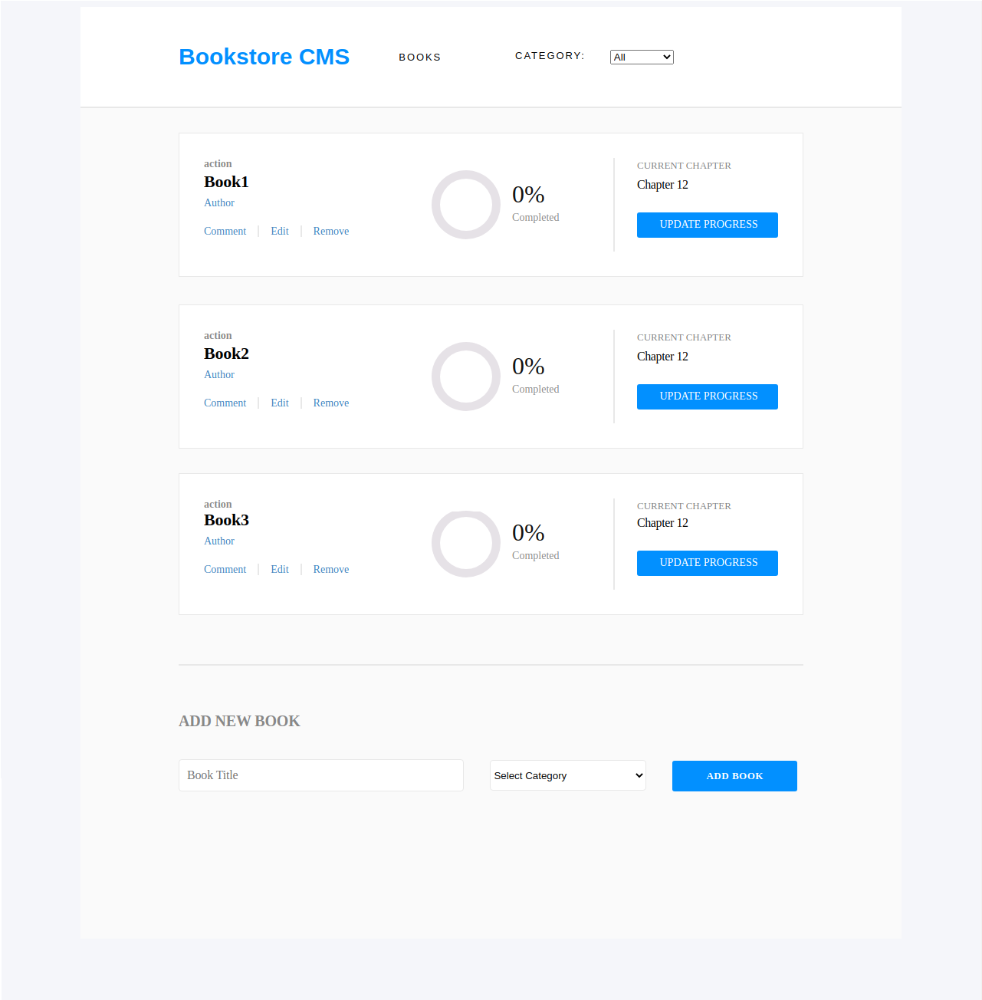

# Bookstore

> Front-end app to manage bookstore dynamically, applying to react and redux basic configuration as components, props, hooks, actions, and reducers. Store books temporarily by name and category, go through the search menu filtering books by category.

## Built

- Javascript
- React
- Redux
- CSS

## Live Demo

[Live Demo](https://bookstore-cms-1.herokuapp.com/)

## Getting Started

To get a local copy up and running follow these simple example steps.

### Prerequisites

- A browser
- Text Editor

### Setup

**STEP 1**
In the terminal, Run the following commands.

- `git clone https://github.com/Jarfsoft/react_calculator.git`
- `cd calculator`

OR

- Download the zip file form `https://github.com/Jarfsoft/react_calculator`

**STEP 2**

- In the Terminal enter `cd bookstore`
- Run `npm install`
- Run `npm start`

## Author

👤 **Juan Andrés Raudales**

- GitHub: [@Jarfsoft](https://github.com/Jarfsoft)
- Twitter: [@Jarfsoft](https://twitter.com/Jarfsoft)
- LinkedIn: [Juan Andrés Raudales Flores](https://www.linkedin.com/in/juan-raudales-flores/)

👤 **Alan Soto**

- GitHub: [@AlanSoto31](https://github.com/AlanSoto31)
- Twitter: [@Alan_Soto31](https://twitter.com/Alan_Soto31)
- LinkedIn: [Alan Soto](https://www.linkedin.com/in/alan-soto-valle/) 

## 🤝 Contributing

Contributions, issues and feature requests are welcome!

Feel free to check the [issues page](https://github.com/Jarfsoft/bookstore/issues).

## Show your support

Give a ⭐️ if you like this project!

## 📝 License

This project is [MIT](https://opensource.org/licenses/MIT) licensed.